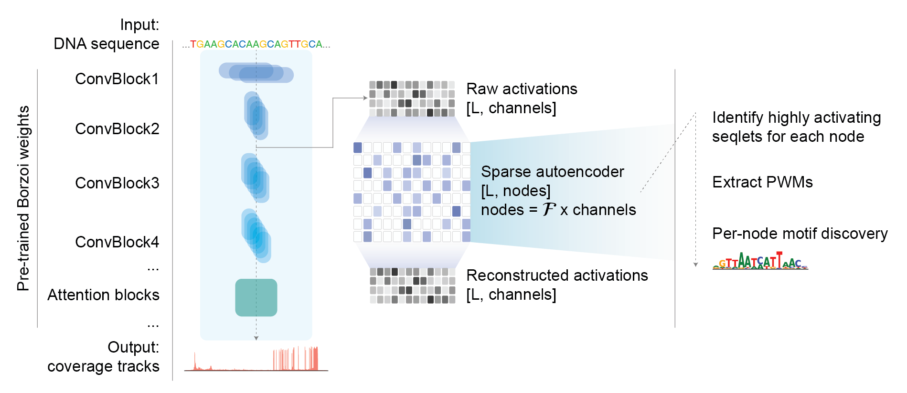

# SAE-Borzoi: sparse autoencoders for DNA sequence-to-function model interpretability

[](https://github.com/calico/sae-borzoi/releases)
[](LICENSE)
[](https://www.python.org/)

> This repository implements **Sparse Autoencoders (SAEs)** for mechanistic interpretability of the [Borzoi](https://www.nature.com/articles/s41588-024-02053-6) genomic sequence model. SAEs decompose Borzoi's learned representations into interpretable features that correspond to regulatory motifs and genomic patterns.

## Table of Contents
- [Overview](#overview)
- [Framework Schematic](#framework-schematic)
- [Installation](#installation)
- [Quick Start](#quick-start)
- [Pipeline Stages](#pipeline-stages)
- [Training Parameters](#training-parameters)
- [Analysis Workflow](#analysis-workflow)
- [Example Usage](#example-usage)
- [Visualization](#visualization)
- [Citation](#citation)
- [License](#license)

## Overview

Deep learning models for regulatory genomics have achieved remarkable predictive performance, yet their internal representations remain a black box. We apply sparse autoencoders (SAEs) to decompose learned representations of Borzoi, a state-of-the-art CNN-transformer for predicting genome-wide molecular phenotypes from DNA sequence. We trained TopK-SAEs on activations from Borzoi's early convolutional layers and discover monosemantic regulatory features that correspond to transcription factor (TF) binding motifs and transposable element sequences. We validated our findings through motif discovery using MEME suite against known TF databases, and identify hundreds of significant position weight matrices that map SAE-discovered features to established TF binding sites. This establishes SAEs as valuable tools for mechanistic interpretability in computational biology.

SAE-Borzoi uses the **Top-K sparsity approach** ([Gao et al.](https://cdn.openai.com/papers/sparse-autoencoders.pdf)) to reconstruct activations from Borzoi's convolutional layers, enabling identification of monosemantic genomic features.

### Key Features
- **Interpretable genomic features**: Maps node activations to known/unknown regulatory motifs
- **Memory-efficient training**: Processes long sequences (524kb) through subdivision
- **Automated motif discovery**: Integrates MEME Suite and TomTom for motif analysis

## Framework Schematic



## Installation

Clone the repository and install dependencies:

```bash
# Clone the repo
git clone https://github.com/calico/sae-borzoi.git
cd sae-borzoi

# (Recommended) Create a virtual environment
python3 -m venv venv
source venv/bin/activate

# Install Python dependencies
pip install -r requirements.txt
```

Or with conda:

```bash
conda create -n sae-borzoi python=3.8
conda activate sae-borzoi
pip install -r requirements.txt
```

- Install [MEME Suite](https://meme-suite.org/meme/) separately for motif analysis.

## Quick Start

### Prerequisites
- Python 3.8+ with PyTorch
- MEME Suite for motif analysis
- SLURM job scheduler (for distributed training)
- Borzoi model activations in HDF5 format

### Running the Pipeline

1. **Configure paths** in `config/config.json`:
   ```json
   {
     "activations_path": "/path/to/borzoi/activations",
     "models_save_path": "/path/to/save/models",
     "expansion_factor": 4,
     "topk_pct": 0.05,
     "learning_rate": 1e-5
   }
   ```

2. **Run the complete pipeline**:
   ```bash
   ./pipeline.sh
   ```

3. **Run specific stages**:
   ```bash
   # Run stages 0-3 (preprocessing through sequence extraction)
   ./pipeline.sh --stage 0 --stop_stage 3
   
   # Run only motif discovery (stages 4-6)
   ./pipeline.sh --stage 4 --stop_stage 6
   ```

### Pipeline Stages

| Stage | Script | Description |
|-------|--------|-------------|
| 0 | `find_global_max.py` | Compute activation normalization values |
| 1 | `batch_train.py` | Train SAE models (distributed) |
| 2 | `batch_infer.py` | Run inference to extract top activations |
| 3 | `save_seqlets.py` | Extract genomic sequences around activations |
| 4 | `run_meme_multi.py` | Discover motifs with MEME |
| 5 | `run_meme_post.py` | Post-process MEME results |
| 6 | `run_tomtom_multi.py` | Match motifs against known databases |
| 7 | `umap_analysis.py` | Generate UMAP visualizations |
| 8 | `seqlet_overlaps_analysis.py` | Analyze feature overlaps |
| 9 | `jaccard.py` | Compute Jaccard similarities |

## Training Parameters

- **Expansion factor**: 4 (hidden dim = 4 × input channels)
- **Sparsity**: Top 5% activations per sequence
- **Learning rate**: 1e-5
- **Input channels**: 608 (conv1d_1 layer)
- **Sequence length**: 196,608 bp (divided into 4 chunks for memory efficiency)
- **Loss function**: MSE + Top-K sparsity (no L1 penalty)

## Analysis Workflow

1. **Feature Selection**: Identifies SAE nodes with:
   - ≥1000 seqlets with non-zero activation
   - ≥200 seqlets with activation > 0.5× mean

2. **Motif Discovery**: 
   - MEME: Discovers up to 2 motifs per node (E-value < 0.05)
   - TomTom: Matches against [Vierstra motif database](https://www.vierstra.org/resources/motif_clustering) (p,q,E-values < 0.05)

3. **Visualization**: SAE-vis server for interactive exploration

## Example Usage

### Train a Single Model
```bash
python scripts/train_one_instance.py --topk 0.05 --exp_factor 4 --lr 1e-5
```

### Run Inference
```bash
python scripts/infer_one_instance.py --topk 0.05 --exp_factor 4 --top_acts 16
```

### Extract Sequences
```bash
python scripts/save_seqlets.py
```

## Visualization

The features are visualized using the SAE-vis server: [motifscout.com](https://motifscout.com).

## Citation

If you use this code, please cite:
- [Borzoi paper](https://www.nature.com/articles/s41588-024-02053-6) for the base model

## License

MIT licence.